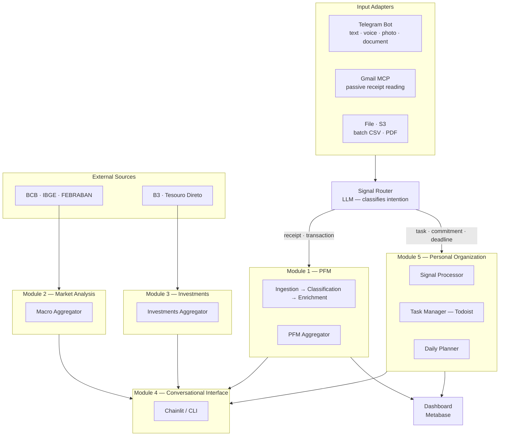

# Architecture Overview

## Core Principle

Telegram and Gmail are the system's input adapters. A **Signal Router** (LLM) classifies the intention of each message and routes it to the correct module — without infrastructure duplication.

> **Why Telegram and not WhatsApp?** Telegram offers an official, free and stable Bot API. WhatsApp has no accessible bot API without cost — unofficial solutions are fragile and against the ToS.

---

## High-level diagram

---

## Technical Stack

- **Python** — orchestration, workers and pipeline
- **MongoDB** (Docker local → Atlas AWS) — primary storage; document that evolves by nature
- **SQS FIFO (AWS)** — message bus between all modules
- **S3 (AWS)** — file staging (CSV, PDF, images)
- **EventBridge** — scheduler for Daily Planner (OPS) and scheduled ingestions
- **Ollama (local)** — local LLM for sensitive data; encapsulated via LLM Facade
- **AWS Bedrock** — production LLM (swap via environment variable, zero rewrite)
- **Telegram Bot API** — primary interactive adapter; supports text, voice, photo and document natively
- **Gmail MCP** — passive reading of receipts and invoices for enrichment
- **Todoist** — task manager integrated into the OPS module via API
- **Pluggy** — Open Finance for automatic transaction ingestion
- **Metabase (self-hosted)** — dashboard over MongoDB

---

## Technical Decisions

| Decision | Choice | Status |
|----------|--------|--------|
| Database | MongoDB — Docker local → Atlas AWS in prod | Decided |
| Message Bus | SQS FIFO (AWS) — event-driven between all modules | Decided |
| Local LLM (dev) | Ollama — encapsulated via LLM Facade | Decided |
| Production LLM | AWS Bedrock — swap via env var, zero rewrite | Decided |
| File staging | S3 (AWS) — automatic trigger to SQS | Decided |
| Workers | Lambda Python 3.12 | Decided |
| Open Finance | Pluggy (free sandbox for validation) | Decided |
| Interactive interface | Telegram Bot API — entry and exit for all modules | Decided |
| Crypto | Binance / Coinbase / CoinGecko | In design |
| Dashboard | Metabase self-hosted (Docker) — native MongoDB support | Decided |
| Task Manager | Todoist — API integration in OPS module | Decided |
| Scheduler | EventBridge — Daily Planner OPS and scheduled ingestions | Decided |
