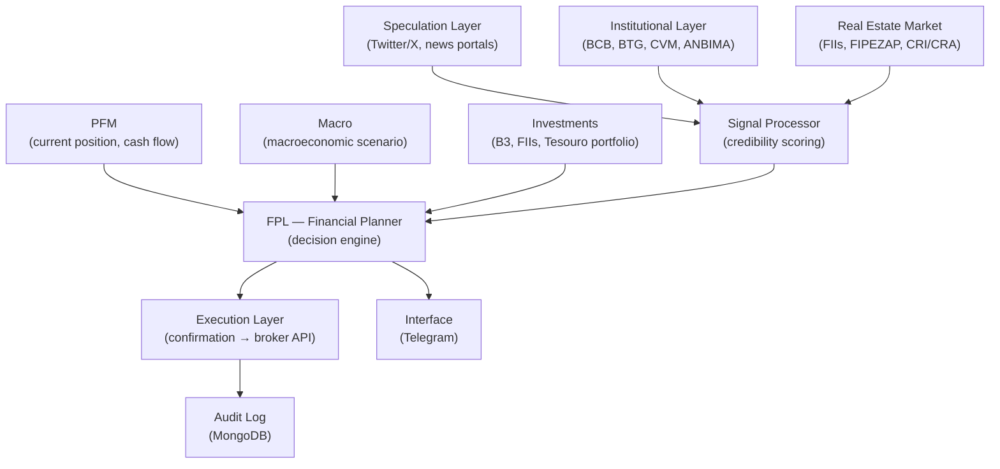

# FPL — Financial Planner

## Module Vision

> **FPL is the only module that makes decisions.** All other modules exist to feed it. PFM brings what you spent. Macro brings what the market is doing. FPL combines both, applies portfolio theory, filters speculation noise, and says: *do this*.

It is not a dashboard. It is not a report. It is a recommendation system with automated execution capability — with mandatory human confirmation before any real movement.

---

## Position in the Architecture



---

## Signal Layers

FPL operates with **two signal types**, with drastically different weights.

### Layer 1 — Speculation (low score, high frequency)

Noisy signals. Useful to detect market sentiment trend, not for direct decision.

| Source | Type | Frequency | Credibility |
|--------|------|-----------|-------------|
| Twitter/X (cashtags $PETR4, $VALE3, etc.) | Sentiment | Real time | Very low — volume filters |
| InfoMoney, Valor Econômico, Bloomberg BR | News | Daily | Low-medium |
| Reddit r/investimentos, r/financaspessoais | Sentiment | Daily | Very low |

### Layer 2 — Institutional (high score, low frequency)

High-credibility signals. LLM does structured extraction from PDF reports.

| Source | Type | Frequency | Access |
|--------|------|-----------|--------|
| BCB — Focus Bulletin | Macro expectations (SELIC, IPCA, GDP) | Weekly (every Monday) | Free public API |
| BCB — Monetary Policy Note | COPOM decision, forward guidance | 8x/year | Free public API |
| CVM — ITR, DFP | Financial statements | Quarterly | Free public API |
| ANBIMA — Capital Markets | Fixed income, debentures data | Daily | Public API |
| BTG / BB / Itaú BBA / XP Research | Sector reports, recommendations | Weekly/Monthly | PDF → S3 → LLM |
| Tesouro Nacional — Tesouro Direto | Public bond rates | Daily | Public API |

### Layer 3 — Real Estate Market

| Source | Data | Access |
|--------|------|--------|
| B3 — FIIs | Quotes, DY, P/VP, vacancy | B3 API / Fundamentus scraping |
| IFIX | FII sector index | B3 |
| FIPEZAP | Average property price by city | Public API |
| CRI/CRA | Secondary receivables market | ANBIMA |

---

## Portfolio Engine

### Primary model: Markowitz + Black-Litterman

Pure Markowitz is hypersensitive to expected-return estimation errors. Black-Litterman fixes this by injecting **views** (investor/analyst opinions) mixed with market equilibrium.

In Harpy Aerie, **views** are generated automatically from Institutional Layer signals.

**Python libraries:** `PyPortfolioOpt`, `riskfolio-lib`, `numpy`, `scipy`

### Brazilian context constraints

| Constraint | Rule |
|------------|------|
| Minimum liquidity | Only assets with daily volume > R$1M |
| Maximum concentration | No asset > 20% of portfolio (except Tesouro) |
| Fixed income IR | Regressive table — preference for maturity > 720d |
| IOF | Never redeem fixed income with less than 30d |
| Tesouro SELIC | Always present — minimum 6-month emergency reserve |
| FIIs | IR exemption on dividends — treat separately in optimization |
| LCI/LCA | IR exemption for individuals — preference when spread > taxed equivalent |

### Macro regime classification

Before optimizing, FPL classifies the current economic regime. This defines the risk weights of the allocation.

```python
class MacroRegime(Enum):
    EXPANSION   = "expansion"    # growth + controlled inflation → risk-on
    OVERHEATING = "overheating"  # growth + high inflation → caution on equities
    STAGFLATION = "stagflation"  # no growth + inflation → NTN-B, commodities
    RECESSION   = "recession"    # no growth + deflation → Tesouro SELIC, liquidity
    RECOVERY    = "recovery"     # growth resuming → cyclical equities, FIIs
```

---

## Recommendation Engine

| Type | Trigger | Confirmation |
|------|---------|--------------|
| Portfolio rebalancing | Drift > 5% from target allocation | Mandatory (Telegram) |
| Contribution opportunity | Available cash + favorable signal | Mandatory |
| Risk alert | Concentration outside limit | Informational (no action) |
| Target allocation update | Macro regime change | Mandatory — user approves new target |
| Real estate suggestion | FII with DY > benchmark + P/VP < 1 | Informational |
| Automatic execution | Tesouro SELIC contribution only (reserve) | Auto — with 30-min cancel window |

### Golden rule

FPL never moves money without explicit confirmation via Telegram. The only exception is automatic contribution to Tesouro SELIC (emergency reserve) within a user-defined limit — with a 30-minute cancellation window.

---

## Execution phases

| Phase | Scope | Status |
|-------|-------|--------|
| **MVP** | Recommendations via Telegram + manual execution by the user | To build |
| **v1.0** | Tesouro Direto via API (Pluggy or TesouroPRO) | Backlog |
| **v1.5** | Broker API (XP, BTG, Clear) via Open Finance (Pluggy) | Backlog |
| **v2.0** | Auto-execution with Telegram confirmation + cancel window | Backlog |
